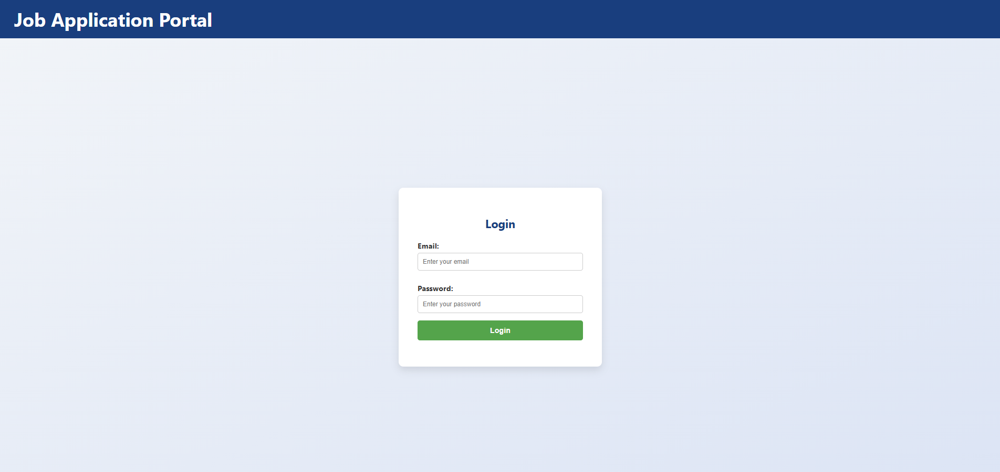

# Job Portal Application
Job Portal is a web-based application built using Java, Spring Boot, JSP, and Tomcat. It allows users to view job listings, post new jobs, and manage applications all with a modern, responsive UI.

## Table of Contents

- [Features](#features)
- [Architecture](#architecture)
- [Interface Snapshots](#interface-snapshots)
- [Usage](#usage)
- [Technologies Used](#technologies-used)

## Features

- **User Authentication:** Secure login and logout functionality.
- **Job Posting:** A form-based UI to post new job listings with fields for job ID, title, description, required experience, and popular technical skills.
- **Jobs Listing:** A responsive, card-based design displays all available job postings.
- **Navigation:** Easy navigation with a top menu bar linking to Home, All Jobs, Post Job, and Contact (LinkedIn).

## Architecture

The application follows a Model-View-Controller (MVC) pattern:
- **Model:** Contains domain objects (e.g., `PostJob`).
- **View:** Uses JSP for the user interface with CSS for styling.
- **Controller:** Handles requests and responses.
- **Service & Repository:** Manage business logic and data storage (in-memory for this demo).

## Interface Snapshots

#### Login Page

#### Home Page

#### Job Post Page

#### Posted Job Page

#### AllJobs Page

## Usage
- **Login:** Use the hardcoded credentials (admin@gmail.com / admin).

- **Home:** The home page provides buttons to navigate to "All Jobs" or "Post Job."

- **Post Job:** Fill in the job details on the form and submit to add a new job.

- **All Jobs:** View the list of all jobs, including newly added ones.

- **Contact:** Click the Contact link to visit the LinkedIn profile page.

## Technologies Used
- Backend: Java, Spring Boot

- Frontend: JSP, CSS

- Build Tool: Maven

- Server: Apache Tomcat

- Version Control: Git, GitHub